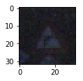
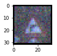
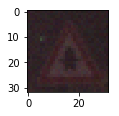
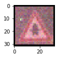
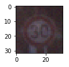
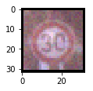

## Building a Traffic Sign Recognition Classifier, Deep Learning Approach 

### Overview  

In this project, I train train and validate a CNN model to classify traffic sign images using the [German Traffic Sign Dataset](http://benchmark.ini.rub.de/?section=gtsrb&subsection=dataset). Below are the following steps of the pipeline that I have developed:  

- Loading the provided raw data, **trainin**, **validation**, and **test** data sets. 
- exploring the raw data, data set size for each category, visualizing, and identifying how it can be pre=-processed to improve model performance in general 
- Applying the modifications to the images and storing the processed data to be loaded for the next runs 
- Defining the CNN model and finetuning hyper-parameters  
- Test and visualize the performance on provided (and processed) **test** data set 
- Visualize itermediate layers' output 

> **Note**: `Cnn` wrapper class is created alongside this jupyter notebook for better code review and readability. In a sense, it is similar to `Keras` library, but of course a lot more limited functionality, just to cover the requirements of this project.  

### 1. Laoding and exploring the provided raw data  

- **Whitenning Images**:  
    While exploring the raw data, I noticed several images that were dark, not really highlighting the features that the CNN could clearly capture. To improve on it, I developed function `Cnn.whiten_images_self_mean` that takes an image as input and slightly enlighten - or whiten - it with respect to its own average RGB values. That can also be performed on HLS space, increasing the light component. But that has worked well for now. Below you can see some examples of the images before and after whitening.  

Before Whitenning             |  After Whitenning
:-------------------------:|:-------------------------:
  |    
 | 
  |    
 |
  |    

***
> **Note**:
There are couple of other appraoches proposed in literatures for image whitenning that I tried, but they did not work as expected. One of them that I already tried is called **Zero Components Analysis** or **ZCA** for short. I think this method requires some basic requirements of training data set that are not met here. After exploring some of the whitenned images, the results were so deviated from the original image that one could not identify the original image. But it is still worth exploring... future work  
- [LINK-1: Preprocessing for deep learning: from covariance matrix to image whitening](https://hadrienj.github.io/posts/Preprocessing-for-deep-learning/)
- [LINK-2: Preprocessing for deep learning: from covariance matrix to image whitening](https://www.freecodecamp.org/news/preprocessing-for-deep-learning-from-covariance-matrix-to-image-whitening-9e2b9c75165c/)  
There are also some general useful guidelines that I followed, such as the link below: 
- [Image Pre-processing for Deep Learning](https://towardsdatascience.com/image-pre-processing-c1aec0be3edf) 

  

- **Data Augmentation**:  
    It is observed that the provided raw data does not have enough data for some categories. More importantly, some features have significantly more data than ohers. Here is the distribution of number of images of each category:  
    
    `features_counts: [ 180 1980 2010 1260 1770 1650  360 1290 1260 1320 1800 1170 1890 1920 690  540  360  990 1080  180  300  270  330 450  240 1350  540  210 480  240  390  690  210  599  360 1080  330  180 1860  270  300  210 210]`
    
    So it is needed to augment the data in a logical way. My simple approach is to generate some fake images of each category by applying slight noises. Function `Cnn.augment_data` is created to perform this job. After data augmentation, equal sample size of each category is selected form the post-processed and augmented data and the results are saved into the `traffic-signs-data` directory for future uses. 
    
    > **Note**: This task needs to be run only once, therefore for future runs, the post-processed data will be loaded for training, validation, and test steps. 
    
    After training-data augmentation process, each category will have enough number of data as follows. 
    
    `features_counts: [1440, 3240, 3270, 2520, 3030, 2910, 1620, 2550, 2520, 2580, 3060, 2430, 3150, 3180, 1950, 1800, 1620, 2250, 2340, 1440, 1560, 1530, 1590, 1710, 1500, 2610, 1800, 1470, 1740, 1500, 1650, 1950, 1470, 1859, 1620, 2340, 1590, 1440, 3120, 1530, 1560, 1470, 1470]`  
        
    However, the training data is loaded such that each category has equal sample size as follows:  
    
    `features_counts: [1440, 1440, 1440, 1440, 1440, 1440, 1440, 1440, 1440, 1440, 1440, 1440, 1440, 1440, 1440, 1440, 1440, 1440, 1440, 1440, 1440, 1440, 1440, 1440, 1440, 1440, 1440, 1440, 1440, 1440, 1440, 1440, 1440, 1440, 1440, 1440, 1440, 1440, 1440, 1440, 1440, 1440, 1440]`  
    
### Defining the CNN model:  

The model arcitecture consists of five CNN layers followed two fully-connected - FC - layers. The parameters of the CNN model is selected and tuned such that it becomes smallet as it goes deeper, i.e. more feature depths but smaller layers. The output of each CNN layer is fed into a batch-normalizer to ensure that the results - trained weights and biases - do not overshoot, causing numerical instability and poor training performance.  

For the FC layers, dropout appraoch is used to prevent overfitting. 

### Results and Discussions  

- **Before Data Augmentation**:  
    After going through 100 iterations on the training data batches - `epochs = 100` - the validatoin accuracy of close to `89%` is achieved - using smaller network. Tracking the training-loss suggets that the model overfit the training data, as the test loss - using the training data - keep decreasing while validation accuracy almost saturates - see the training log below.  
    
    
`Training... start
Epoch 10: Test Cost: 0.1957 --- Valid Accuracy: 0.8329 Epoch 20: Test Cost: 0.0632 --- Valid Accuracy: 0.8719
Epoch 30: Test Cost: 0.0262 --- Valid Accuracy: 0.8878
Epoch 40: Test Cost: 0.0135 --- Valid Accuracy: 0.8961
Epoch 50: Test Cost: 0.0165 --- Valid Accuracy: 0.8855
Epoch 60: Test Cost: 0.0038 --- Valid Accuracy: 0.8882
Epoch 70: Test Cost: 0.0050 --- Valid Accuracy: 0.8966
Epoch 80: Test Cost: 0.0021 --- Valid Accuracy: 0.8868
Epoch 90: Test Cost: 0.0024 --- Valid Accuracy: 0.8791
Epoch 100: Test Cost: 0.0013 --- Valid Accuracy: 0.8871
Training... end`  

- **After Data Augmentation**:  
    After going through 50 iterations on the training data batches - `epochs = 50` - the validatoin accuracy of close to `97%` is achieved. Tracking the training-loss suggets that the model performance is resonable and it did not overfit the training data. This is later confirmed by using the **test** data set that is not exposed to the model at all. The overall test accuracy is observed to be `95%`. 

### Potential Improvement Areas  

I can think of couple of improvement areas that I would like to explore. 

-  **Utilizing more training data**:  
   In general, by adding more clear and clean data of each category, the performance should be improved. Currently, the data augmentation is done by applying some level of noise. However, by adding more cear publicly-available data - that are clean and clear - one may improve the performance.  
   
-  By examining the wrong predictions, it is observed that some of them are actually from the first 9 categories that are related to speed limit signs. Therefore, One way is to train a CNN model solely for the first 9 categories and the other one for all 43 categories - or just the other 34 categories. The final score will be decided after passing the test images into both CNNs. One benefit is that one may use smaller CNN size to get better speed and accuracy performance.  

